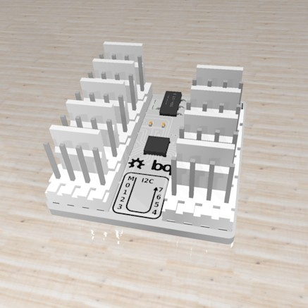

# I2C Multiplexer
#### PCA9548 i2c multiplexer board and library

&nbsp;

This repository contains the multiplexer board and  an arduino library. 

This module is useful when multiple i2c devices must be connected to a microcontroller but share fixed addresses, for example using several identical sensors with the same hardware-defined address. To solve this connect each offending sensor to different i2c buses and simply select the appropiate channel before communicating with the device as usual.

#### BOARD

·The board has one input i2c channel and eight output ones. The input works at 5V level while the rest work at 3.3V.
&nbsp;
·It has eight possible, hardware-defined I2C addresses, which are selectable through three solder pads, as in the following table:

| A2 | A1 | A0 | I2C Address |
| :---: | :---: | :---: | :---------: |
| 0  | 0  | 0  |    0X70     |
| 0  | 0  | 1  |    0X71     |
| 0  | 1  | 0  |    0X72     |
| 0  | 1  | 1  |    0X73     |
| 1  | 0  | 0  |    0X74     |
| 1  | 0  | 1  |    0X75     |
| 1  | 1  | 0  |    0X76     |
| 1  | 1  | 1  |    0X77     |

&nbsp;
·The pads on next to each connector enables that bus' 4.7k pullup resistors. These pads should be soldered if there were no other pullup resistors on the bus.
&nbsp;

#### LIBRARY

· To install the library simply copy the folder "I2CMux" into your folder "sketchbook/libraries/".

&nbsp;

· The module's address is passed to the constructor, while the channel is selected by the method "switchToBus(busNumber)", with busNumber between 0 and 7.

&nbsp;

· In the "examples" subfolder an example sketch is available which demonstrates how to switch between different i2c channels, reading data from two [BNO055](https://github.com/bqlabs/BNO055) sensors with the same address in different buses.
